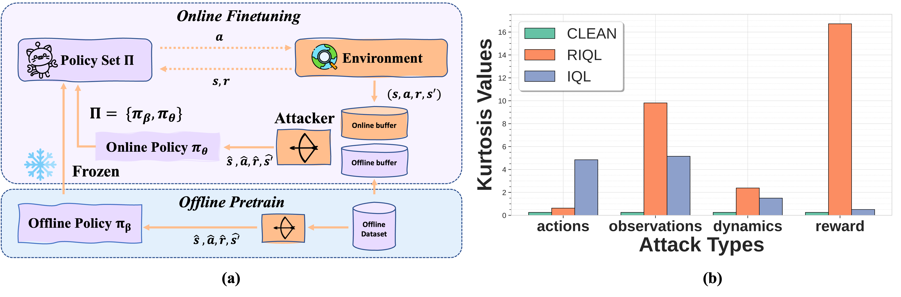

# RPEX: Robust Policy Execution

This repository contains the official implementation of our NeurIPS 2025 submission titled "RPEX: Robust Policy Expansion for Offline-to-Online RL". 

## Abstract

Pretraining a policy on offline data followed by fine-tuning through online interactions, known as Offline-to-Online Reinforcement Learning (O2O RL), has emerged as a promising paradigm for real-world RL deployment. However, both offline datasets and online interactions in practical environments are often noisy or even maliciously corrupted, severely degrading the performance of O2O RL. Existing works primarily focus on mitigating the conservatism of offline policies via online exploration, while the robustness of O2O RL under data corruption, including states, actions, rewards, and dynamics, is still unexplored. In this work, we observe that data corruption induces heavy-tailed behavior in the policy, thereby substantially degrading the efficiency of online exploration. To address this issue, we incorporate Inverse Probability Weighted (IPW) into the online exploration policy to alleviate heavy-tailedness, and propose a novel, simple yet effective method termed \textbf{RPEX}: \textbf{R}obust \textbf{P}olicy \textbf{EX}pansion. Extensive experimental results on D4RL datasets demonstrate that RPEX achieves SOTA O2O performance across a wide range of data corruption scenarios.


## Installation

<!-- 1. Clone the repository:
```bash
git clone https://github.com/yourusername/RPEX.git
cd RPEX
``` -->

1. Create and activate a virtual environment:
```bash
conda create -n your_name python==3.10
conda activate your_name  
```

2. Install dependencies:
```bash
pip install -r requirements.txt
```

## Usage
Run RPEX with random dynamics corruption:
### Offline Pretrain (RIQL)
```bash
python attack_offline.py --env_name="hopper-medium-replay-v2" --algorithm="riql" --normalize_states --corrupt_dynamics
```
'env_name' can be 'halfcheetah-medium-replay-v2', 'walker2d-medium-replay-v2', 'hopper-medium-replay-v2', ....

The default values of corruption_range and corruption_rate are set to 1.0 and 0.3 during the offline period, and 1.0 and 0.5 during the online period, respectively. These parameters can be customized using the `--corruption_range` and `--corruption_rate` flags, following the same syntax as the offline configuration.

Replace '--corrupt_dynamics' with '--corrupt_reward', '--corrupt_acts', and '--corrupt_obs' to enforce corruption on rewards, actions, and dynamics.
### Offline-to-Online Attack (Ours)
```bash
python attack_online.py --env_name="hopper-medium-replay-v2" --algorithm="rpex" --normalize_states --corrupt_dynamics --ckpt_path="./riql_offline_results/stochastic_norm/hopper-medium-replay-v2/offline-RIQL-attack-7031-a4ee/offline_ckpt"
```

## Project Structure

```
RPEX/
├── attack_offline.py      # Offline attack implementation
├── attack_online.py       # Online attack implementation
├── read_res.py           # Results analysis utilities
├── RIQL_TRAIN_CONFIG.py  # Training configuration
├── pex/                  # Core algorithm implementation
│   ├── algorithm/        # Algorithm implementations
│   └── network/          # Network architectures
├── iql_offline_results/  # IQL offline checkpoints results
├── riql_offline_results/ # RIQL offline checkpoints 
pretrained_model/ # adversarial attack
```

<!-- ## Results

Offline experimental results and checkpoint can be found in the `iql_offline_results/` and `riql_offline_results/` directories. -->

<!-- ## Citation

If you use this code in your research, please cite our paper:

```bibtex
@inproceedings{rpex2024,
  title={RPEX: Robust Policy Execution},
  author={Your Name and Co-authors},
  booktitle={Advances in Neural Information Processing Systems},
  year={2024}
}
```

## License

This project is licensed under the MIT License - see the [LICENSE](LICENSE) file for details. -->
<!-- 
## Contact

For questions or feedback, please contact [Your Email].

## Acknowledgments

We would like to acknowledge the following works that inspired and contributed to our research:

- [RIQL](https://github.com/YangRui2015/RIQL): Towards Robust Offline Reinforcement Learning under Diverse Data Corruption
- [PEX](https://github.com/Haichao-Zhang/PEX): Policy Expansion for Bridging Offline-to-Online Reinforcement Learning

We also thank the open-source community for their valuable contributions to reinforcement learning research.


 -->
